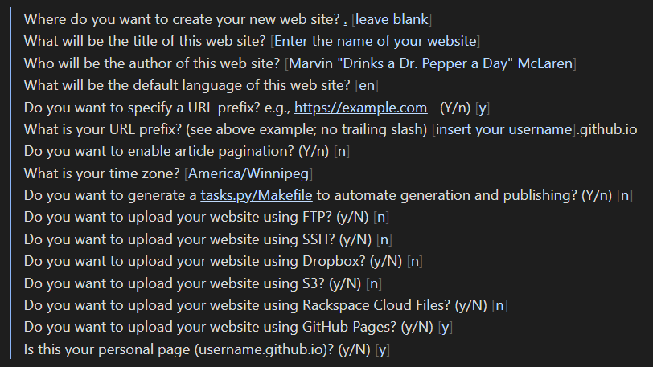
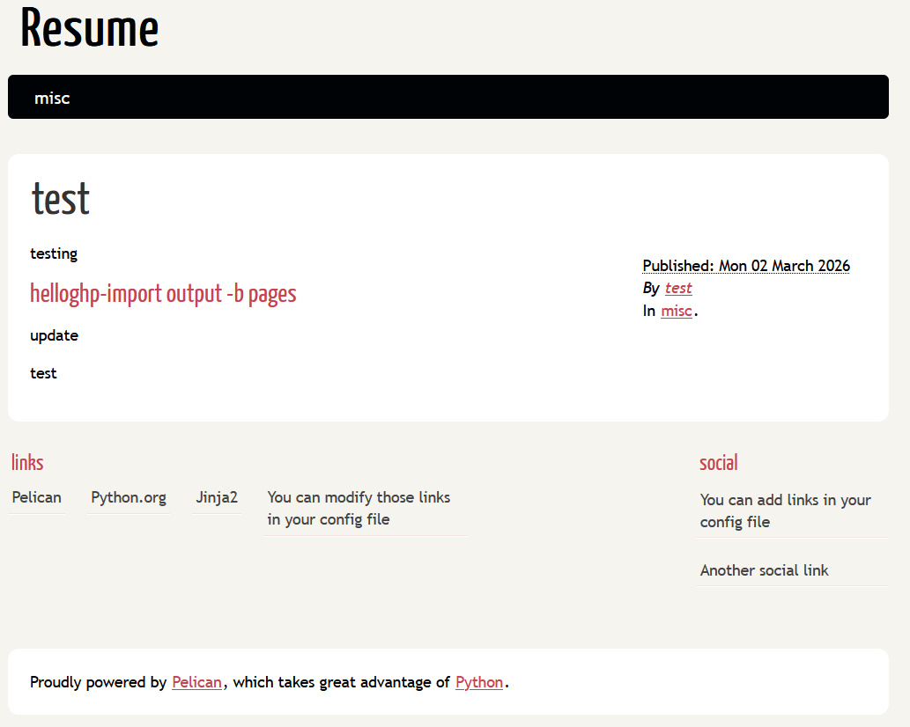
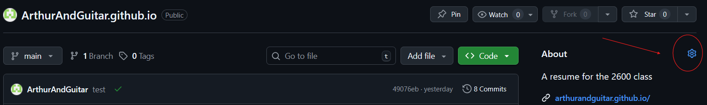
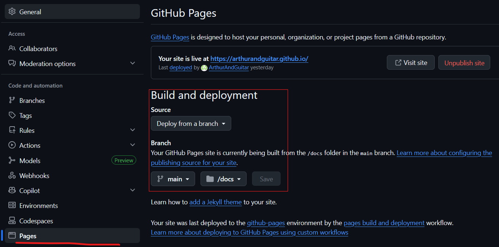

# Creating a Website with Pelican and Hosting on GitHub
Arthur McMullen 
2025/03/04
## Table of Contents:
- [Purpose](#Purpose)
- [Prerequisites](#Prerequisites)
- [Instructions](#Instructions)
	- [Setting up distributed version control and Forge](#Setting-up-distributed-version-control-and-Forge)
	- [Making a website with Markdown](#Making-the-Website-with-MarkDown)
	- [Creating a static website](#Creating-the-Static-Website)
	- [Enabling GitHub Pages](#Enabling-GitHub-Pages)
	- [Publishing Content onto the Website](#Publishing-Content-onto-the-Website)
- [Further Reading](#Further-Reading)
- [FAQ](#FAQ)
- [Credits](#Credits)
## Purpose
This is a guide for Marvin McLaren on creating a static website to host a resume. Will be employing tools like Forges, Version Control and Static website generators to achieve this. Furthermore, will expand on Andrew Etters Principles of Modern Technical writing. Will use tools like VScode and GitHub to get familiar with tools developers use.
## Prerequisites 
- A computer
- A resume to host 
- A free evening or weekend and a Dr. pepper 

| Program                                                    | What it is                                            |
| ---------------------------------------------------------- | ----------------------------------------------------- |
| [VSCode](https://code.visualstudio.com/)                   | Software for editing files                            |
| [Pelican](https://getpelican.com/)                         | Converts markdown files into a static website         |
| [Python](https://www.python.org/downloads/)                | A programming language Pelican requires to run        |
| [Git](https://git-scm.com/install/windows)                 | Version Control                                       |
| [GitHub Account](https://github.com/signup)                | A forge for hosting our repository and website online |
| [GitHub Desktop App](https://desktop.github.com/download/) | An application for GitHub                             |

## Instructions 

1. Set up a distributed version control and Forge
2. Design a webpage with Markdown
3. Convert the markdown file into a website
4. Enable GitHub Pages
5. Publish our website onto GitHub.
### Setting up distributed version control and Forge
We will use Git for our distributed version control and GitHub for our forge. Git is the underlying mechanism that allows us to easily manage our system, create backups, and allow for collaboration. Etter recommends using these tools to get familiar with how programmers use them and allowing for easy contribution.

Go to GitHub and create a new repository.
> Repositories > new 

In the repository name field, enter:
```
[insert your username].github.io
```
Will use this format to access GitHub Pages which is GitHub's free service for hosting static websites. 
- Check that visibility is set to public.

Remember this URL for your static website for later.

- Move the online repository onto your PC:

	1. Open GitHub Desktop App
	2. Log into your GitHub Desktop account
	3. clone the repository onto GitHub desktop.
		- click on "current repository" at the top left of the app.
		- click on "add"
		- click on "clone repository..."
		- copy + paste the link of your repository to the repository URL field under the URL tab.
			- WARNING, the link to your repository is different then the link to your static website.
		- Decide where the folder will be located under local path. Leaving the default option is fine.
		- click on "clone" 

- Confirm in the GitHub Desktop App that the name of our repository is assigned the correct name, you can see the name on the top left of the app.


### Making the Website with Markdown
Will now design our website using a lightweight mark up language, in this case markdown. Static websites are made up of HTML which looks complicated and hard to read. Instead of bashing our heads against a wall, we can convert markdown, which is simple to learn and easier to read, into HTML using a static website generator later.

For that, will have to learn how to write in markdown. 

[Here is a guide on some of the basic syntax for GitHub's flavor of markdown](https://github.com/adam-p/markdown-here/wiki/markdown-cheatsheet).
To make writing in markdown easier, will need a program to render the text. While VSCode is able to render the files, its missing functionality. Instead, I would suggest trying [obsidian](https://obsidian.md/) which is a free markdown rendering tool.

Keep in mind that at the top of the file, we need the text: 
```
title: [title of your webpage]
date: [YYYY/MM/DD]
```
### Creating the Static Website
Etter recommends using a Static website generator to automate publishing our document over manually creating it in the principle of allowing easy iterations. Furthermore, it lets our generated documents be beautiful and scannable, another of Etter's principles. So, we will use a static website generator to turn a markdown document into a website written in HTML. 

1. navigate to the website folder you had assigned earlier in VSCode.
	- Open: > file > open folder
		- Find the path to your project folder.
		- Note: If you created the repository with the default path, it should look something like this: C:\Users\[user]\Documents\GitHub

2.  Install pelican by running the command in the VSCode terminal:
```
python -m pip install "pelican[markdown]"
```

3. Type In the terminal at the bottom of the VSCode to start pelican's static website creation process:
```
pelican-quickstart
```

4. Answer the following questions like so:


5. Navigate to your pelicanconf.py file.
6. Add the line at the bottom of pelicanconf.py:
	```
	OUTPUT_PATH = 'docs'
	``` 
	- GitHub Pages requires this to know where to look to generate the static website.

7. Create a new markdown file in the content folder
	- Check the file ends with `.md`
	- Copy and paste the lightweight markup context into markdown

8. Convert the lightweight mark up language into HTML in Pelican by typing:

```
pelican content
```
into the terminal 

9. Preview the website your hosting by typing:
```
pelican --listen
```
into the terminal. 
- Use this command often, it allows us to preview and iterate quickly which follows in Etter's principles.

10. Hold down CTRL on the keyboard and Click on the blue hyperlink in the console to make sure the website opens. The website should look like this, the default theme.


### Enabling GitHub Pages
GitHub Pages is GitHub's way to allow users to host their own static websites. However, we have to enable this feature in our repository. GitHub is a forge which is a platform which hosts repositories, allows for collaboration, and version control. Because of its ease of accessibility, shareability and proximity to developers, Etter recommends using static websites for technical documentation.

1. Navigate to your GitHub repository website.
2. Click on the cog icon for the specific repository

3.  Enable the "Use your GitHub Pages website" option

To make sure GitHub Pages can find the output created by pelican's Static Forge, we must change where it looks.

1.  Navigate to the GitHub repository website.
2.  Click on the repository's settings tab
3.  Click on "Pages" under "Code and automation" on the sidebar
4.  Make sure the Source under Build and Deployment is set to "Deploy from a branch"
5.  Make sure the branch is set to main 
6.  Change the folder from "./root" to "./docs"
7.  Make sure the result looks like this 

# Publishing Content onto the Website
Making publishing simple is paramount for easy iteration, one of Etter's principles.

Now to change the contents of the webpage:
- Navigate to the GitHub Desktop App
- Type, in the summary required field, publish
	- What you enter can be anything 
- Click Commit to main
- Push to Origin
	- this sends it to the website

Check your website at [insert your username].github.io to make sure it's rendering. At this point, you're all done.
# Further Reading
For further reading, you can check out:

For use of GitHub Pages
https://docs.github.com/en/pages/quickstart

GitHub flavored Markdown cheat sheet
https://github.com/adam-p/markdown-here/wiki/markdown-cheatsheet

On using Obsidian:
https://obsidian.md/

For viewing a variety of Pelican Themes:
https://pelicanthemes.com/
# FAQ

##### Q: Why am I getting [windows error 5] when running pelican content?
A: That's because VSCode doesn't have permission to delete the contents of the docs folder, its likely an issue caused by Window's One Drive cloud service. Deleting the docs folder manually instead works perfectly. 

##### Q: Why is it called a static website
A: A static website is opposite of a dynamic website. An example of a dynamic website is twitter which can change what the site generates depending on data stored by the website. In contrast, a static website is more like a book, it doesn't hold any data that can change, so the website is fixed and will be the same for anyone who sees it. 
## Credits

- Nikolaas Christie 
- Bradley Barrientos
- Pelican default theme by [Enrique Ramírez](https://enrique-ramirez.com)from [Smashing Magazine](https://www.smashingmagazine.com/2009/08/designing-a-html-5-layout-from-scratch/) 

